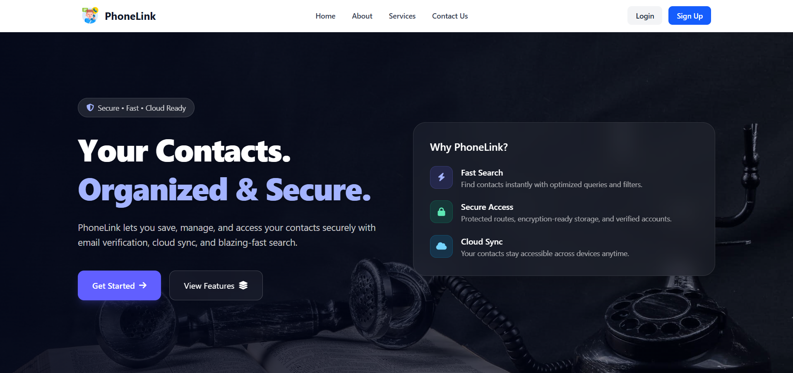
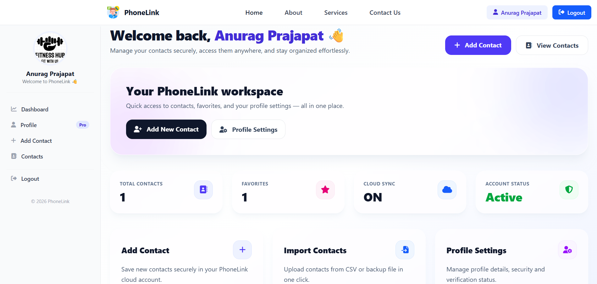
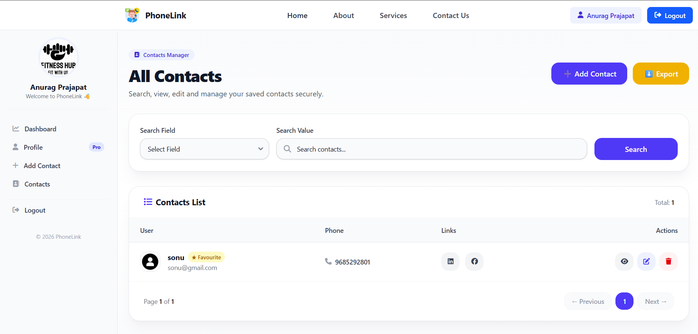

<p align="center">
  
</p>

<h1 align="center">📱 PhoneLink</h1>

<p align="center">
  A modern <b>Contact Management App</b> built with <b>Java, Spring Boot, Thymeleaf & Tailwind CSS</b>.<br>
  Effortlessly manage your contacts, verify emails & phones, and stay organized.
</p>

---

## ✨ About PhoneLink

**PhoneLink** is a sleek, modern web app to **manage your contacts** securely.  
It supports **email verification, phone verification, profile management**, and **CRUD operations** on contacts.  

Built with **Java Spring Boot**, **Thymeleaf**, and **Tailwind CSS**, it’s fully **responsive** and easy to use.  

---

## 🌟 Features

- 🔐 **User Authentication** – Secure login & registration  
- ✉️ **Email Verification** – Confirm email before using the app  
- 📞 **Phone Number Verification** – Validate contact numbers  
- 👤 **Profile Management** – Update your name, email, and password  
- 📝 **Contact CRUD** – Add, edit, delete, and view contacts  
- 📱 **Responsive Design** – Works on desktop & mobile  
- 🔒 **Secure Passwords** – Encrypted with Spring Security  

---

## 🛠 Tech Stack

| Layer          | Technology                     |
|----------------|--------------------------------|
| **Frontend**   | Thymeleaf + Tailwind CSS       |
| **Backend**    | Java + Spring Boot             |
| **Database**   | MySQL                          |
| **Security**   | Spring Security                |
| **Tools**      | IntelliJ IDEA, Git, Postman    |
| **Server**     | Localhost / Any Cloud Server   |

---

## 🖼 Screenshots
<p align="center">
  
  
  
</p>
---

## 🚀 Getting Started

### Prerequisites

- Java 17+  
- Maven 3+  
- MySQL Database  
- Git  

### Installation

```bash
# Clone the repository
git clone https://github.com/yourusername/phonelink.git
cd phonelink

# Setup MySQL database
CREATE DATABASE phonelink_db;

# Update src/main/resources/application.properties with your DB credentials

# Run the project
mvn spring-boot:run
